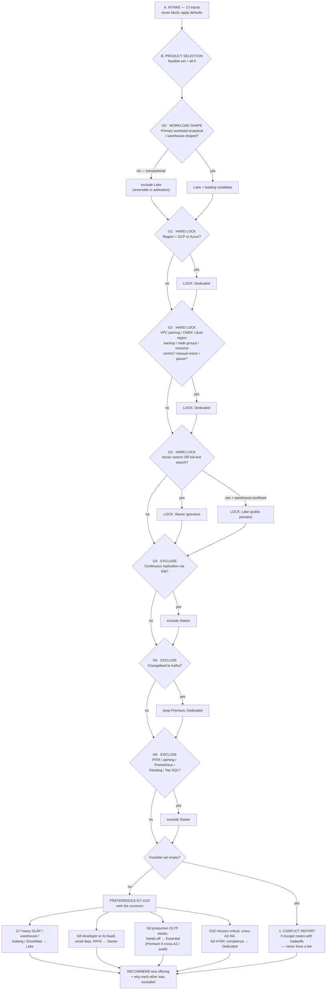

# Product Selection Decision Tree

Evaluate the gates **in order**. Carry a *feasible set* of offerings, starting with
`{Starter, Essential, Premium, Dedicated, Lake}`. Hard locks reduce it to one; exclusions
remove members; preferences rank whatever survives.

Record, for every gate that fires, which input triggered it — the report must explain why
each offering was excluded, not just which one won.

## Mind map

---

## Phase 0 — Workload shape (positions Lake)

Run this before the hard locks. It decides whether Lake is a candidate at all, so that a
transactional migration never carries an unexplained warehouse product through to the
ranking phase.

| Primary workload | Effect |
|---|---|
| Transactional (OLTP), or OLTP + reporting (HTAP) | **Exclude Lake** — reason: "analytical product, workload is transactional". The four TiDB Cloud tiers remain. |
| Analytical / warehouse-shaped (large-scale scanning and aggregation, Iceberg, BI serving, replacing Snowflake/BigQuery/Redshift) | **Lake becomes the leading candidate.** Keep the transactional tiers only if the customer also has an OLTP system of record in scope. |
| Both, as separate systems | Both stay in. Expect to recommend two products and say which serves which workload. |

Use intake item 7. If it is unknown, default to transactional and record the assumption —
most PoC conversations are migrations, and wrongly proposing a warehouse is a worse failure
than wrongly omitting one.

**This exclusion is reversible during conflict arbitration.** If Phase 1–2 produces an empty
feasible set, Lake returns as Route B — at that point it is being offered as a deliberate
architecture change, not as a match to the stated workload.

## Phase 1 — Hard locks

A hard lock reduces the feasible set to a single offering. If two hard locks fire and
disagree, that is a conflict — jump to *Conflict arbitration*.

### G1 — Cloud provider and region

| Requirement | Result |
|---|---|
| Google Cloud region | **LOCK Dedicated** (Starter/Essential/Premium have no GCP) |
| Azure region | **LOCK Dedicated** (Premium on Azure is under development) |
| AWS region | no constraint |
| Alibaba Cloud region | excludes Dedicated |

Ask for the region explicitly. Customers often state a cloud without realizing it is the
single most binding constraint in the whole conversation.

### G2 — Enterprise infrastructure and compliance

Any one of these **LOCKs Dedicated**:

- VPC peering (private endpoint alone does **not** trigger this — all tiers have it)
- CMEK (customer-managed encryption keys)
- Dual-region backup
- Node groups (workload isolation inside one cluster)
- Resource control / quotas
- Manual cluster resizing, or pause & resume
- New Relic integration

Database audit logging is *not* here — it is available on Premium (✅) and Dedicated (✅), so
it narrows rather than locks.

### G3 — Vector search or full-text search

Per `product-matrix.md`, these live on **Starter only**.

| Requirement | Result |
|---|---|
| Vector search, or full-text search | **LOCK Starter** (preview) |
| …and the workload is warehouse-shaped (heavy aggregation, Iceberg, analytics-first) | **LOCK Lake** (public preview) instead |

Distinguish carefully: a transactional app that also does semantic retrieval → Starter.
An analytics platform whose primary job is large-scale scanning and aggregation, with vector
or full-text as one of several engines → Lake.

Always attach the preview caveat, and the documentation-contradiction note from
`product-matrix.md`, whenever this gate fires.

---

## Phase 2 — Exclusions

### G4 — Continuous replication from production (DM)

If the customer needs ongoing replication from a live source database (not a one-shot
cutover): **exclude Starter.** DM is unavailable there.

Essential and Premium have it in preview; Dedicated has it GA. If the customer needs DM to be
GA rather than preview, narrow further to Dedicated.

### G5 — Changefeed to Kafka

Downstream streaming (Kafka, and by extension Flink/data-lake pipelines fed from it):
**keep only Premium and Dedicated.** Essential has it in private preview (🔒, needs a support
ticket); Starter has none.

### G6 — Production observability and recoverability

Any one of these **excludes Starter**:

- Point-in-time recovery
- Alerting
- Prometheus / Grafana integration
- Datadog integration
- Top SQL
- Manual backup (narrows to Premium/Dedicated)

Most customers describing a production migration will trip at least one of these. That is
usually what rules Starter out even when nobody said "we need PITR" — ask.

---

## Phase 3 — Preferences

Apply to whatever survived. These rank rather than eliminate; if several fire, prefer the one
matching the customer's *primary* workload.

### G7 → Lake
Heavy OLAP, data-warehouse workload, Iceberg tables, replacing Snowflake/BigQuery/Redshift,
elastic analytical compute decoupled from storage, AI-oriented analytical workflows.
Always label public preview.

### G8 → Starter
Developer projects and **AI/SaaS applications**; small or unknown data volume; wants
pay-as-you-go with no capacity planning; values SQL Editor and Data Branch; no production
recovery/observability requirements yet.

### G9 → Essential
Production OLTP that wants elasticity and no capacity management. Adds PITR, alerting,
backup recycle bin, DM (preview) over Starter.
**Prefer Premium instead** if the customer needs cross-AZ failover, Kafka changefeeds,
manual backup, or database audit logging — and label Premium public preview.

### G10 → Dedicated
Mission-critical systems; cross-AZ HA; **full HTAP via TiFlash**; enterprise compliance;
predictable provisioned capacity; GCP/Azure. This is also where everything locked by G1/G2
lands.

---

## Conflict arbitration

**Trigger**: the feasible set is empty, or two hard locks disagree.

The structural cause is almost always G3 (vector/full-text → Starter) colliding with
G1/G2/G4/G5/G6 (→ away from Starter). Concretely: *anything that needs vector or full-text
search plus anything production-grade.*

**Do not resolve this yourself. Do not pick a tier anyway.** Emit a "⚠️ Requirement conflict"
section naming the exact requirements that collide, then present all three routes with their
tradeoffs and let the customer choose:

### Route A — Split clusters
Starter for the vector / full-text workload, Essential or Dedicated for transactional data.
The application routes queries to the right cluster.

- **Cost**: two clusters.
- **Complexity**: application-layer routing; data must be synchronized between them, and the
  sync path itself needs designing (this is an open question, not a solved one).
- **Risk**: the search side is still on a preview feature.
- **Best when**: the search workload is genuinely separable from the transactional one.

### Route B — TiDB Cloud Lake
One engine covering ANSI SQL, vector, and full-text.

- **Cost**: warehouse compute, separate from the transactional cluster.
- **Complexity**: low if analytics is the whole story; the Lake ↔ transactional-cluster
  integration path is not clearly documented — flag it.
- **Risk**: public preview. Not appropriate for a customer who needs GA guarantees.
- **Best when**: the workload is analytics-first and the customer tolerates preview.

### Route C — Externalize search
Keep business data in TiDB (any tier that satisfies the production constraints); put vector
or full-text in a purpose-built external service.

- **Cost**: a third-party service.
- **Complexity**: dual writes and consistency management between TiDB and the search store.
- **Risk**: lowest on the TiDB side — no preview dependency.
- **Best when**: production constraints are non-negotiable and search is secondary.

Also state the fourth possibility explicitly: **confirm the vector tier availability first.**
Because the TiDB docs contradict each other (see `product-matrix.md`), the conflict may not
be real. Confirming with the account team before redesigning the architecture is the cheapest
move available and should be listed as the first action item.

---

## Output format for Stage B

Produce, in this order:

1. **Recommendation** — one offering, named.
2. **Why** — the gates that led there, quoting the customer's own stated requirement for each.
3. **Why not the others** — one line per excluded offering, naming the gate that removed it.
   Never leave an offering unexplained; "not recommended" without a reason is not acceptable
   output.
4. **Preview/beta caveats** — every preview-status feature the recommendation depends on.
5. **Conflicts**, if any — the full arbitration section above.
